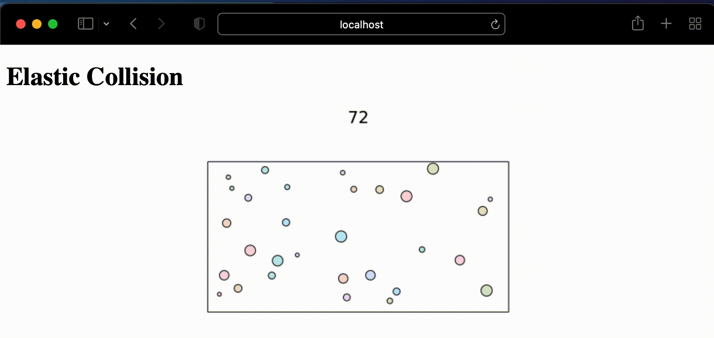

# ElasticCollision.jl

- Genie app utilize [GeometryObjects.jl](https://github.com/AtelierArith/GeometryObjects.jl)



# Usage

## Prerequisite

1. Install Julia from [here](https://julialang.org/downloads/)
2. git clone this project:

```console
$ cd /path/to/your/workspace
$ git clone --recursive https://github.com/AtelierArith/ElasticCollision.jl.git
```

3. instantiate project:

```console
$ cd /path/to/ElasticCollision.jl
$ julia --project=@. -e 'using Pkg; Pkg.instantiate()'
```

## Running Julia server

```
$ cd /path/to/ElasticCollision.jl
$ julia --project=@. -e 'using Pkg; Pkg.instantiate()'
$ ./bin/server
```

then open your web browser and go to `http://localhost:8000/`

### Tips

You can adjust the number of particles and the length of time gif via `http://localhost:8000/?maxT=300&num_particles=60`